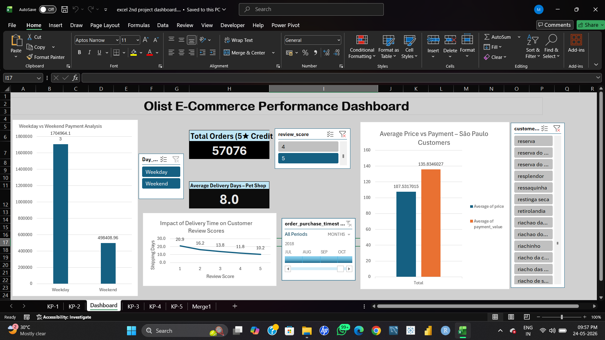

# 📊 Project 2: Data Analysis (Excel + Tableau)

## 📌 Project Overview
This project focuses on analyzing data using Excel and visualizing insights using Tableau.  
The goal is to identify trends, patterns, and business insights from the dataset.

---

## 🛠 Tools Used
- Microsoft Excel (Data Cleaning & Analysis)
- Tableau (Dashboard & Visualization)

---

## 📷 Project Screenshots

### Excel Dashboard

### Tableau Dashboard

---

## 📂 Project Files

### 📊 Tableau File
Download here:  
👉 [Click to view/download](https://drive.google.com/file/d/1QXj633txGsq7s8_UavnDhulki1RZuGZq/view?usp=sharing))

### 📈 Excel File
Download here:  
👉 [Click to view/download](https://docs.google.com/spreadsheets/d/1JeVRWkN2UJVj67tSX_RAipJ2EAKlmy28/edit?usp=sharing&ouid=113814594491696851260&rtpof=true&sd=true)

---

## 🔍 Key Insights
- Identified sales trends over time  
- Analyzed customer behavior  
- Found top-performing categories/products  

---

## ✅ Conclusion
This project demonstrates data analysis and visualization skills using Excel and Tableau.
